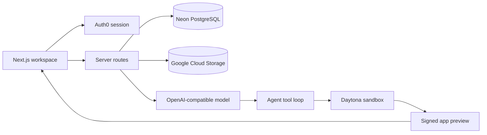

# Cognix AI App Builder

Cognix is a full-stack prompt-to-app builder built with Next.js. It gives each project a Daytona development sandbox, streams an OpenAI-compatible coding agent into a Lovable-style workspace, persists product data in Neon PostgreSQL, authenticates users with Auth0, and stores uploads in private Google Cloud Storage.

## Support Us

- Support us via Buy Me a Coffee: https://buymeacoffee.com/cognix/
- Sponsor us on GitHub: https://github.com/sponsors/Raunak-dev-18/
- Support us via PG: https://dodo.pe/curator-oss-support

<iframe src="https://github.com/sponsors/Raunak-dev-18/card" title="Sponsor Raunak-dev-18" height="225" width="600" style="border: 0;"></iframe>

## What is included

- Auth0 v4 authentication through the Next.js proxy and server-side session checks
- Neon PostgreSQL schema for users, projects, messages, project files, and attachments
- Daytona sandbox lifecycle, terminal execution, filesystem tools, and signed previews
- OpenAI-compatible Chat Completions client with a custom base URL and model ID
- Multi-turn streamed tool loop for listing, reading, writing, searching, running, and previewing code
- Private Google Cloud Storage uploads, with image inputs staged into Daytona and sent to vision-capable models
- Responsive dashboard, project chat, live iframe preview, file explorer, and editable code view
- Auth0-powered sign-in and account creation with real profile avatars

## Architecture



The agent instructions live in `src/lib/ai/system-prompt.ts`. Unlike the referenced Lovable prompt, they assume a real remote environment: the agent uses terminal and filesystem tools directly, installs dependencies, runs checks, starts the app on `0.0.0.0:3000`, and returns a signed Daytona preview.

## Local setup

Requirements: Node.js 20 or newer and npm 10 or newer.

1. Copy `.env.example` to `.env.local` and add provider values.
2. Install dependencies with `npm install`.
3. Apply the database schema with `npm run db:push`.
4. Start Cognix with `npm run dev`.
5. Open `http://localhost:3000`.

Without `DATABASE_URL`, projects use an empty in-memory development store and are lost when the server restarts. Configure Neon before creating real projects.

## Provider setup

### Auth0

Create a Regular Web Application and configure:

- Allowed Callback URL: `http://localhost:3000/auth/callback`
- Allowed Logout URL: `http://localhost:3000`
- Allowed Web Origin: `http://localhost:3000`

Add the equivalent production URLs before deployment. Authentication endpoints are mounted at `/auth/*` by the Auth0 SDK.

### Neon PostgreSQL

Set `DATABASE_URL` to the pooled Neon connection string with `sslmode=require`, then run:

```bash
npm run db:push
```

The checked-in SQL baseline is in `drizzle/0000_initial.sql`.

### Daytona

Set `DAYTONA_API_KEY`. `DAYTONA_API_URL` defaults to `https://app.daytona.io/api`, and `DAYTONA_TARGET` selects the region. Cognix creates one labeled Node.js sandbox per project and uses automatic stop/archive intervals to control idle usage.

### OpenAI-compatible model

Configure:

```dotenv
OPENAI_API_KEY=YOUR_PROVIDER_KEY
OPENAI_BASE_URL=https://your-provider.example/v1
OPENAI_MODEL=YOUR_TOOL_CAPABLE_MODEL
```

The provider must implement the OpenAI Chat Completions streaming and tool-calling shape. Use a vision-capable model when prompts include image attachments.

### Google Cloud Storage

Create a private bucket and grant the runtime service account permission to create and read objects. Configure `GOOGLE_STORAGE_BUCKET` and `GOOGLE_CLOUD_PROJECT`. For local development, set `GOOGLE_APPLICATION_CREDENTIALS` to the downloaded service-account JSON path. Alternatively, provide `GOOGLE_STORAGE_CREDENTIALS` as single-line service-account JSON, or use Application Default Credentials in the hosting environment.

Uploads are validated at 15 MB and limited to images, PDF, Markdown, text, and JSON. Object bytes remain private and are served through an authenticated application route.

## Commands

```bash
npm run dev          # start the local app
npm run lint         # lint the codebase
npm test             # run unit tests
npm run build        # create the production build
npm run db:generate  # generate Drizzle migrations after schema changes
npm run db:push      # apply the schema to Neon
```

## Security notes

- Never expose provider keys through `NEXT_PUBLIC_*` variables.
- The coding model receives only its prompt, selected image inputs, and sandbox tool results.
- Host credentials are not copied into generated app sandboxes.
- All project pages and API routes require a real Auth0 session.
- Rotate any credential that has been pasted into a chat, issue, log, or other shared surface.
